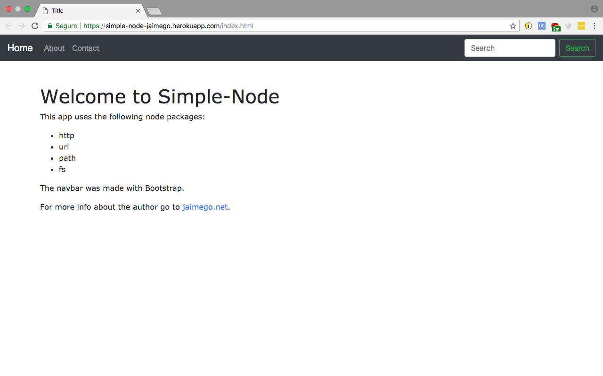

# simple-node
A simple and functional node server made for educational purposes with Bootstrap and deployed in Heroku: https://simple-node-jaimego.herokuapp.com/

It can deal with different file formats.

